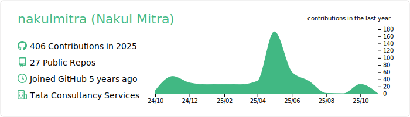

  

# 👋 Hi, I'm Nakul Mitra

I'm a passionate **Software Developer** with over 4 years of experience in building robust backend systems using Java, Spring Boot, PostgreSQL, and Redis. I enjoy solving complex problems, optimizing system performance, and working on scalable microservice-based applications.

## 🧑‍💼 Professional Summary

- 💼 4 years of backend development experience at **TCS**, currently working at **Sopra Steria**.
- 🛠️ Lead developer of **Prime Events**, an internal event management platform
- ☕ Refactored monolith to microservices for improved scalability
- 🚀 Implemented Redis-based sliding window rate limiting using custom annotations and AOP
- 📈 Worked on performance tuning, HQL issue resolution, and scalable microservice architecture
- 🏆 Received **15+ awards & appreciations** for contributions

## 🛠️ Tech Stack

- **Languages:** Java, Python, SQL  
- **Frameworks:** Spring Boot, Hibernate
- **Libraries & Tools:** Spring Data JPA, Jackson, SLF4J
- **Database & Caching:** PostgreSQL, Redis  
- **Dev Tools:** Git, Maven, Spring Tool Suite, VS Code
- **Other Skills:** REST APIs, Microservices, Redis Rate Limiting, AOP, Linux, Exception Handling

## 📚 Currently Learning

## 📄 Resume

## 💼 Project Portfolio

Check out my complete project portfolio here 👉 [View Portfolio](https://github.com/nakulmitra/project-portfolio)

## 🧰 Tools & Technologies

## 📺 YouTube Channel: Dev Portal

I run a YouTube channel called **Dev Portal** to simplify backend concepts for developers. I cover:

- 🧵 Java (Threads, Collections, Core)
- 🛢️ PostgreSQL (Indexing, CTEs, Optimization)
- 🧪 Mini projects and backend architecture

👉 [Check it out here](https://www.youtube.com/@DevPortal2114)

<!-- BEGIN YOUTUBE-CARDS -->
[")](https://www.youtube.com/watch?v=8ZY1YwGl23o)
[")](https://www.youtube.com/watch?v=e_1YdFg2bqg)
[")](https://www.youtube.com/watch?v=t6_JD1vV9ms)
[")](https://www.youtube.com/watch?v=u9eJPAiu0eE)
[ | Linux for Developers (Part 3)")](https://www.youtube.com/watch?v=DhOb4bLk2t8)
[")](https://www.youtube.com/watch?v=bJYMqC8Xais)
<!-- END YOUTUBE-CARDS -->

## 🤝 Let's Connect

## 📊 GitHub Stats

  <!--  -->
  <!--  -->
  
  <!--  -->
  

<!-- ## 🧾 Recent Commits -->

<!--  -->

**Always learning. Always building. Let's connect and collaborate!**